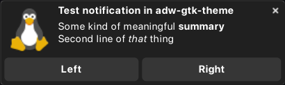

# rustyfications

Rusty notification daemon for Wayland.

---



`Rust` | `Gtk4` | `gtk4-layer-shell`

---

## Running

Currently you need to run it manually. Be sure that no other notification daemons is running

```bash
cargo run --release
```

<details>
<summary><i style="display:inline-block">in case it throws `NameTaken` error</i></summary>

```bash
# check what other notification daemon is running
# example output
# org.freedesktop.Notifications                          432884 DAEMONNAME            USERNAME :1.6094       user@1000.service -       -
busctl --user list | grep org.freedesktop.Notifications

# kill it
killall DAEMONNAME
```

</details>

### Automation

You can create a file `/usr/share/dbus-1/services/com.bzglve.rustyfications.service`

put the following in it

```conf
[D-BUS Service]
Name=org.freedesktop.Notifications
Exec=/usr/bin/rustyfications
```

and of course copy binary to bin directory

```bash
sudo cp target/release/rustyfications /usr/bin/rustyfications
```

From now you don't need to manually start daemon. It will be activated automatically on any client request

## Planning

- configuration
- more capabilities and hints support
- ipc like stuff to call already running daemon
- [SwayNotificationCcenter](https://github.com/ErikReider/SwayNotificationCenter)-like sidebar window
- packaging

## Motivation

Practice myself and write something that I will use every day.

Other tools don't quite meet my needs.

Highly inspired by [SwayNotificationCcenter](https://github.com/ErikReider/SwayNotificationCenter)
